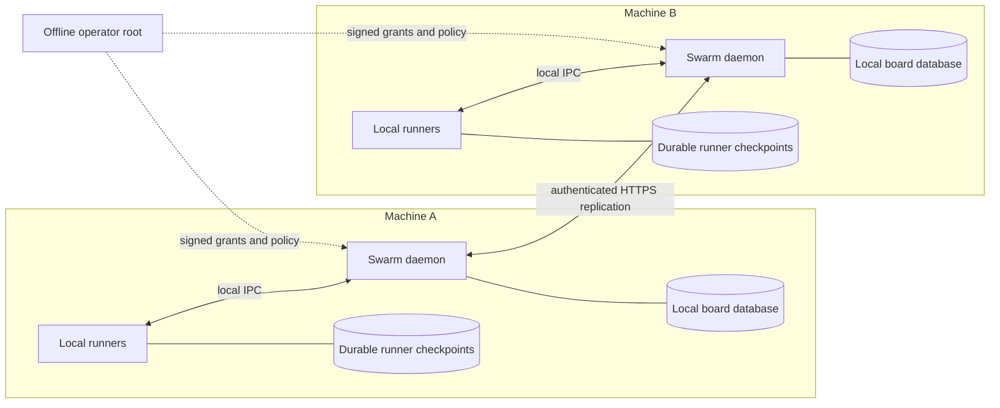

# Task 038: self-forming private swarms

Status: proposed implementation specification, 2026-09-28. No swarm runtime
exists yet. This replaces the historical shared-filesystem board design in
[task 038](../../tasks/ongoing/038-cross-machine-agent-communication.md).
The [review report](038-design-review.md) records independent scrutiny.

## 1. Product contract

The owner selected a private swarm, automatic admission with an invite, tens
to hundreds of machines, and a reachable LAN or private VPN for v1. Target
examples are provisioned AWS/Hetzner servers and many workers on one large
Linux machine. Operators distribute deployment configuration; they do not
register each machine or maintain a list of agent addresses.

A machine starts one Hugin daemon, generates its own identity, discovers peers,
and advertises locally configured agents. Each daemon owns a durable local
board. Authorized peers replicate records; there is no central Hugin board,
registry, leader election, global message order, or mandatory cloud service.
Agents converse through `post`, `read`, `ask`, and `reply`. Network records cannot directly install code, dispatch commands, or select
interaction imports. An influenced model still has its locally granted tool
authority; receiving applications must enforce their own sandbox/allowlist.

V1 does require reachable private IP addresses, trustworthy host clocks, local
durable disks, and at least one reachable contact for a cold join. Cloud/VPN
provisioning remains outside Hugin. Native internet NAT traversal, public
anonymous admission, distributed session migration, exactly-once external
side effects, and thousands of machines are outside this release.

## 2. Deployment and operator experience

`create`, `invite`, `join`, and the local-file form of `status` are implemented
by the provisioning increment. The daemon, runner flags, and socket form of
`status` below remain proposed interfaces. Secret material is read from a
protected file, never a shell argument.

```sh
# Once, on the operator's administration machine; root key stays here.
hugin swarm create --name research --output /secure/hugin/research-admin
hugin swarm invite --admin /secure/hugin/research-admin \
  --scope research:read,post --seed 10.42.0.10:7443 \
  --seed 10.42.0.11:7443 --output /secure/hugin/research.invite

# Explicitly form the first node, supplied by deployment automation.
hugin swarm join --invite-file /run/secrets/research.invite \
  --mesh-cidr 10.42.0.0/16 --state-dir /var/lib/hugin/swarm \
  --initialize-first --bootstrap-bundle /run/secrets/research-bootstrap.json

# Later nodes omit the first-node flags and contact an online seed.
hugin swarm join --invite-file /run/secrets/research.invite \
  --mesh-cidr 10.42.0.0/16 --state-dir /var/lib/hugin/swarm
hugin swarm status --state-dir /var/lib/hugin/swarm

# Proposed daemon, runner and service status interfaces:
hugin swarm daemon --state-dir /var/lib/hugin/swarm \
  --budget-config /etc/hugin/swarm-budgets.yaml

# One or many separately supervised local runners; configs/code are local.
hugin run --task research --task-path /opt/hugin/research \
  --swarm-socket /run/hugin/swarm.sock --durable-session ./runner-state \
  --resident --session-call-limit 100
hugin swarm status --socket /run/hugin/swarm.sock
```

`create` also produces the initial signed authorization snapshot. To start an
empty swarm, the first daemon starts from that local trusted state without
requiring another peer. `create` writes a public bootstrap bundle without the root private key.
Provision the first host with that bundle and its protected invite, using
`hugin swarm join --invite-file ... --bootstrap-bundle ... --initialize-first`.
For the sample above, privately deliver `research.invite` to
`/run/secrets/research.invite` and copy
`/secure/hugin/research-admin/bootstrap.json` to
`/run/secrets/research-bootstrap.json`; never ship the admin directory.
This is explicit initial formation, never an automatic fallback when existing
seeds are unreachable. Its address becomes an ordinary bootstrap contact;
starting the second daemon is then a normal join. Seed addresses are hints,
not special authorities. Store at least two contacts in different failure
domains where available. First-node provisioning and subsequent join use the
same identity and authorization checks.

AWS/Hetzner path: Terraform or equivalent creates instances, private routing
(or an existing cross-provider VPN), firewall rules, and secret delivery.
Cloud-init installs a pinned Hugin build, runs `join`, then starts the daemon
and allowlisted runner services under systemd. Permit only the configured
swarm port within the mesh; the admin socket remains host-local. Hugin never
calls cloud provisioning APIs or receives cloud administration credentials.
Provider/model credentials are provisioned locally, never carried in invites
or board records. A private address in two unrelated clouds is not sufficient:
operators must establish cross-cloud routing/VPN first.

Single Linux host path: one daemon, one board, many isolated runner processes
or containers communicating through an explicitly mounted local socket.
Containers do not need separate peer identities merely to run more agents.
Independent daemons are allowed for testing or isolation, with separate keys,
ports, directories and network policies. Host IDs and worker counts are
reported separately. Autoscaling adds/removes runners without changing the
swarm membership protocol. `--resident` explicitly opts into continued service
after the initial local task completes; ordinary `hugin run` retains its
current finite lifetime. Cloud service templates select resident mode.

Images contain Hugin and trusted application code, not initialized node keys,
board databases or invite secrets. Generate identity on first boot; persist it
on the host's disk across restart. A copied initialized disk is the same node,
not a new machine: detect identity/advertisement forks and require rekeying.
The daemon and each durable runner acquire exclusive local OS locks. V1 does
not promise safe active/active operation of one copied identity.

`join` validates and initializes local state then exits; network discovery is
the daemon's job. Rerunning with the same swarm/key is idempotent; a different
swarm on an initialized directory fails without overwriting it. Optional
`--wait-ready 30s` waits for status after the service starts. Exit codes: 0
initialized/ready as requested, 2 invalid configuration/credentials, 3 readiness
timeout, 4 state/ownership conflict. Initialization success is not readiness.
The budget file requires explicit host hourly allowance (60 for smoke tests)
and per-session limits; production values are operator decisions.

Status returns explicit states: `joined`, `waiting_for_peer`, `unauthorized`,
`authorization_stale`, `unreachable`, `capacity_reached`. Existing members can
continue when every original seed disappears. A cold host with no reachable
contact waits with jittered retries; it cannot discover a private swarm from
nothing. `status` reports this distinction. Graceful shutdown stops admission,
flushes checkpoints, advertises withdrawal and reports pending delivery;
forced shutdown relies on the recovery rules below. Liveness means the daemon
event loop responds; readiness additionally requires valid credentials/policy,
writable storage, validated budget configuration and a reachable authorized
peer (or explicit first-node initialization). A previously formed node may
operate locally through a partition while reporting degraded connectivity.

Scale-in uses `hugin swarm drain --timeout 120s --min-other-replicas 1 --json`.
It withdraws eligibility and rejects new local workflow admission. Finish
active work within the deadline, flush runner outboxes, then enter a persisted
drain fence: stop accepting new replicated bodies and stop issuing new
termination-durability confirmations. Serve already retained bodies and public
policy metadata while draining. It never migrates a runner.

After that fence, request fresh confirmations (bound to a new drain ID) from
currently authorized, non-draining peers for every unexpired retained record,
including records originally authored elsewhere. A peer atomically checks its
own persisted drain state and durable record before confirming; its eventual
drain is subject to the same rules. Historical replica receipts are insufficient.
A restarted draining host keeps the fence until the operator cancels drain or
terminates it. Two draining hosts cannot freshly confirm each other. Success
requires no unresolved admitted work, no unflushed outbox and the requested
number of other confirmed replicas for every retained record; return
`safe_to_terminate`. Otherwise return `drain_incomplete` with active/ambiguous
workflow and unreplicated-record IDs. Sequential and simultaneous scale-in of
the final two replicas must leave at least one blocked until record expiry or
an explicit operator decision to accept loss. Abrupt disk failure after a
confirmation can still lose a copy; this contract covers planned termination.
Cloud automation must defer termination, retain the volume, or explicitly
record acceptance of loss. An operator can abandon work explicitly but cannot
turn an absent replica receipt into a successful durability claim. Early
resolution at an asker does not remotely cancel already admitted responders.
Drain confirmation is a point-in-time result: shutdown immediately under the
same admission fence before deleting the disk.

## 3. Components and data ownership



The daemon owns membership, authorization, replication, message storage and
local delivery queues. It does not run models or dynamically load application
code. Runners retain session/stack ownership and register through a protected
Unix-domain socket. Daemon registration binds OS-user authorization, node ID,
session ID, agent ID, and runner incarnation. An exclusive session owner is
required; a stale incarnation cannot acknowledge or consume a new owner's
messages. Creation, restore, configuration changes and orderly exit update
registration. The daemon only advertises locally allowed capabilities.

Both board and durable checkpoint stores use local SQLite transactions,
separate from the existing generic `Storage.save_file` abstraction. The board
is not placed on NFS/S3/shared storage. Require durable commits and explicit
schema migrations. If WAL is selected, require `synchronous=FULL`, bounded
checkpointing, and a patched supported SQLite runtime; verify actual runtime
capabilities at startup rather than assuming Python's version determines them.
SQLite documents the local-host WAL restriction and durability trade-off.
[SQLite WAL documentation](https://www.sqlite.org/wal.html)

Board logical records: immutable envelopes, first-receipt journal, peer
checkpoints, membership adverts, authorization snapshots, local inbox/outbox
states, delivery receipts and expiry tombstones. Record uniqueness is
`(swarm_id, author_node_id, message_id)`; identical retry is idempotent, same
key with different signed bytes is a conflict. No last-write-wins overwrite.

Runner checkpoint: coherent session/agent/stack state, pending and attached
external inputs, stable delivery IDs, read cursors, outstanding asks, outbound
messages, provider-call reservations and outcomes. Required interactions are
restored through local trusted registries only. Missing/corrupt required state
stops recovery visibly; it must not be skipped as the existing loader permits.
Artifacts and external tool side effects remain separate resources. Restoring
an old backup is not ordinary restart: quarantine restored sessions for
operator reconciliation, change the board database epoch, and never silently
reuse rolled-back execution receipts or budget state.

## 4. Admission, identity and authorization

Use established Ed25519 and X.509 implementations, not bespoke cryptography.
An offline root defines `swarm_id = SHA256(root public key)`. It signs an
invitation intermediate certificate (`pathLenConstraint=0`) and a grant
containing grant ID, swarm ID, invitation issuer SPKI fingerprint,
group/action scope and validity. The validator requires that issuer fingerprint
to match the leaf chain's actual invitation intermediate; a public grant from
another issuer cannot be substituted. The envelope grant ID must match this
validated grant, and the leaf cannot introduce another intermediate. An invite
contains that intermediate's signing key, certificate, grant, root public
certificate/fingerprint, initial authorization snapshot and seed hints. It
never contains the root private key. It is a reusable bearer secret.

A joining node generates its own Ed25519 key and issues a leaf certificate
under the invitation intermediate. `node_id = SHA256(node public key)`.
Peers validate the complete chain, grant and current policy, with mutual TLS;
application envelopes also carry origin signatures so a relay cannot become
the author. Validate leaf key usages, swarm binding and grant scope on every
operation. A transport spike must prove the exact library stack supports this
chain and identity validation, including certificates issued without an
online CA. Root changes create a new swarm in v1.
[Certificate path validation](https://www.rfc-editor.org/rfc/rfc5280.html),
[Ed25519](https://www.rfc-editor.org/rfc/rfc8032.html).

Membership never outlives the invitation grant; initial lifetime is 30 days.
An offline verifier cannot distinguish genuinely early enrollment from a
backdated certificate minted by someone who kept an expired invite. Therefore
v1 does not promise permanent membership after a short joining window.
Deployment automation supplies replacement grants before expiry. Renew the
leaf under the replacement grant using the existing node key, validate both,
then atomically replace active credentials; allow an overlap interval while
existing connections reconnect. Renewal preserves identity, receipt IDs and
budgets. Old grants never acquire new permissions. Warn at seven days, one day
and one hour before grant expiry; warn at 48 hours and six hours before policy
expiry. Expose these timestamps in machine-readable health output. Invite files
are removed after leaf issuance where possible, though a holder can retain a
copy. Store all private keys with restrictive permissions; redact secrets from
logs, process arguments, errors and diagnostic bundles.

Root-signed authorization snapshots contain monotonically increasing
generation, issued time, expiry, revoked grant IDs and revoked node IDs.
Default validity is seven days; distribute signed refreshes before expiry
through any peer or deployment automation. The root need not be online for
joining or messaging, but an operator must periodically sign a refresh.
Persist the highest generation and reject rollback or conflicting content at
the same generation. A new node starts with at least the invite's policy
floor. Existing TLS sessions do not bypass newer policy.

A separate bounded policy-recovery endpoint exposes only root-signed policy
snapshots, never membership or group data. This endpoint requires no client
certificate: a stale client omits its leaf on this separate connection and
validates the server's current chain against its pinned swarm root. Normal
endpoints still require mutual TLS and current authorization; prove route
isolation in the transport spike. Do not bypass server certificate validation.
The response is untrusted until its root signature, swarm, times and generation
are verified against the persisted floor; fetching it cannot grant data access.
Limit response to 1 MiB, one in-flight request per address and a host aggregate
rate. Local provisioning can always install a newer signed snapshot. If no
server has a valid leaf, recovery requires local provisioning/credential
renewal. An expired client leaf/grant still needs private credential renewal
before ordinary traffic resumes. Test day-eight joining with a still-valid
invite, and policy refresh with all data endpoints denied.

Revocation is eventually learned; an isolated node can use stale authority
until its snapshot expires. With clocks within 60 seconds, seven days plus
clock tolerance is the maximum stale-authorization window, not immediate
revocation. Expired policy stops remote reads, writes, replication and new
remote-triggered work; local unrelated work may continue. In-progress work
checks authorization again before each model/tool dispatch. It cannot undo
an already started side effect. Keep revocations until credentials expire.
A leaked invite requires revoking the entire grant and privately provisioning
a replacement to intended members; revoking one node cannot stop the holder
minting another identity. Group removal prevents future access, not erasure
of copies a previously authorized reader already obtained.

Possession of a live invite permits multiple identities. No single-use invite,
global node quota, proof of physical-machine uniqueness, Sybil resistance or
Byzantine consensus is claimed. Replica counts count keys, not independent
failure domains. Scope invites narrowly; group data is visible to authorized
replica hosts. There is no end-to-end confidentiality from those hosts.

Permissions are the intersection of signed grant, local operator policy and
agent configuration. Separate actions: `read`, `post`, `ask`, `reply`; board
replication requires `read`. An ask requires permission to receive its replies;
a responder needs read/reply permission. Permissions apply to group IDs;
topics/capability labels are advisory discovery filters, not authority.
Addresses are `(node_id, agent_id)`; agent UUIDs/roles alone prove nothing.
Replies can only claim agents in their signing node's namespace.

## 5. Discovery and bounded replication

V1 uses authenticated HTTPS over the reachable private network. Pin a supported
Python async client/server stack during the transport spike, in an optional
`swarm` dependency extra; do not reuse the unauthenticated monitor server.
Native NAT traversal requires a separate transport decision and relay tests.
Hole punching itself still needs reachable infrastructure.
[libp2p hole punching](https://libp2p.io/docs/hole-punching/)

Each host keeps an active directory for up to 512 fresh node IDs; target
qualification is 100 and 300 machines. Expired adverts release active slots
after five minutes; neither a transient connection failure nor retiring a slot
revokes the identity. Durable author certificates, revocations and replay
sequence floors are separate from active connection slots. Retain advert
sequence floors until all earlier adverts must have expired plus clock
tolerance, and author evidence while a retained record requires it. Require
advert expiry <= signed issue time + five minutes and reject future issue
times beyond tolerance, so a retired stale advert cannot revive membership.
Bound historical metadata by bytes and retention (within the board budget);
if exhausted, backpressure with an explicit reason. Rejoining with a fresh
valid advert reuses a slot. The churn test must replace nodes with fresh keys,
not merely restart existing identities. A node advertises its endpoints,
incarnation, persistent increasing advert sequence, local agents, group
subscriptions and capabilities. Advert expiry is five minutes, refreshed every
60 seconds with jitter; silence means unavailable, not revoked. Cap an advert
page at 8 KiB, total membership data per node at 128 KiB; page/version digest
prevents mixing partial agent snapshots. Persist the highest advert sequence;
reject stale/reordered updates. Addresses are accepted only after validation.

Maintain at most eight outbound and 32 inbound authenticated sessions per
host, plus a bounded pre-authentication handshake pool. Periodic sessions
rotate over known peers, with direct priority for pending selected recipients
and fair service for each subscribed group. Metadata can be exchanged across
swarm members; group bodies only across authorized interested replicas.
Post/ask origins lacking group read permission may push only their own
committed records to discovered authorized group readers. They keep a bounded
durable outbox until expiry and report replica acknowledgments; this grants
no permission to fetch other bodies. Discovery exposes node-level group
transport capability to swarm members; detailed agent roles/capabilities are
visible only to group readers.
Partner selection explicitly schedules direct contacts between group readers;
it cannot rely on unrelated hosts relaying private records. Retry busy peers
with jitter and backoff; distribute bootstrap load across available contacts.
Initial anti-entropy interval is five seconds; idle backoff caps at 30 seconds.
Transient reachability errors never revoke identity or delete data.

V1 replicates retained group records to every authorized interested board host.
This trades simple offline recovery for O(group-hosts × retained bytes) storage
and network cost. It is not constant total traffic and is not an all-to-all
connection mesh. Group subscriptions partition load. Subscriber counts are a
local observation, never globally authoritative. Late joiners can read retained
history, but historical posts do not automatically wake new agents.

Replication uses a peer-local first-receipt journal, not sender timestamps or
maximum author sequences. Exchange bounded pages of IDs, request absent
bodies, validate each, and transactionally commit bodies and the completed
page checkpoint. Receiving an existing record never appends another journal
entry. A checkpoint is scoped to peer ID, database epoch, group/filter and
authorization scope. Database replacement or scope change invalidates it.
Do not advance a checkpoint past uncommitted bodies on storage/backpressure
failure. Permanently invalid entries are recorded as rejected with a reason,
without stalling unrelated valid records indefinitely. A missing referenced
ask or author certificate is a pending dependency, not permanent invalidity:
persist a bounded non-executable pending record with that page checkpoint,
then fetch the dependency from an authorized peer. Dependency state has the
same size/expiry limits and survives restart. If it fills, stop advancing the
page. Once dependencies arrive, validate before appending to the accepted
record journal or admitting work; expiry produces an explicit rejection. This borrows the
changes-feed/checkpoint pattern; it is not CouchDB wire compatibility.
[Apache CouchDB replication protocol](https://docs.couchdb.org/en/stable/replication/protocol.html)

The server reports a monotonic compaction watermark. Deleting any body or
journal entry at sequence S advances this watermark to at least S, even when
older bodies remain: expiry order need not match receipt order. A cursor below
that watermark returns `history_gap`, then a bounded retained-history resync
starts. Resync pins an upper journal sequence, pages retained records up to
that sequence, then continues journal sync above it. A watermark change that
invalidates an in-progress resync triggers a reported retry, not silent skips. Surface
the missing interval even after resync; discarded history cannot be recovered
if every copy is gone. Continuation tokens are opaque scoped values, never
paths. Fair exchange among reachable authorized group hosts converges for
records that survive long enough; a partition beyond retention cannot.

Endpoints from adverts are IP literals within configured mesh CIDRs and the
configured port. Normalize IPv4-mapped IPv6; disallow loopback, link-local,
unspecified, multicast and broadcast addresses. No redirects or environment
proxies. Operator-configured DNS seeds may resolve, but every resolved IP is
checked and pinned per connection. Authenticate the expected peer identity
before board requests; seed discovery initially accepts any current authorized
swarm node. Never fetch record URLs, certificate URLs or artifact references.
Use a three-second connect timeout and ten-second request deadline.

## 6. Envelope, retention and delivery semantics

Strict v1 schema: `v`, `kind` (`post|ask|reply`), `swarm_id`, `message_id`,
`author_node_id`, `agent_id`, `grant_id`, `group`, `topic`, `created_at`,
`expires_at`, `trace_id`, `parent_id`, `hop_remaining`, `body`, and signature.
Ask additionally includes immutable `recipients`, `required_replies`,
`reply_deadline`; reply includes the fully qualified original ask key. Validate
`created_at < reply_deadline <= expires_at`, maximum one-hour duration, unique
recipient addresses and `1 <= required_replies <= recipient_count <= 16` on
inbound asks as well as locally generated ones. Optional
fields are explicitly enumerated per kind; reject unknown v1 fields/versions.
Certificates/grants are bounded attached evidence, validated separately.

Sign all semantic fields with a domain-separated version prefix and canonical
JSON from a maintained RFC 8785 implementation. Reject duplicate keys,
nonfinite/floating point numeric fields, excess nesting, invalid UTF-8 and
noncanonical signed representations. Use integer counters and UTC timestamps
with fixed precision. ID fields have fixed encodings/lengths; group/topic names
are bounded validated strings, never filesystem paths (`.` and `..` rejected).
Remote records never pass through `Interaction.from_dict` or dynamic imports.
[JSON canonicalization](https://www.rfc-editor.org/rfc/rfc8785.html)

A record has an immutable absolute expiry, no later than creation + 72 hours
or its signing grant's expiry. Reject future creation beyond 60 seconds,
expired records, invalid validity intervals and signatures. Receiving,
retransmitting or rebooting never extends expiry. Nodes need synchronized
clocks within 60 seconds; detected rollback/skew stops remote execution until
repaired. Expiry tolerates at most that skew. Application timeout at the asker
is stricter as described below.

Retain body until its expiry and delivery dedupe/tombstone records through
expiry + clock tolerance. Never discard an unexpired accepted body silently
to meet a disk cap: backpressure new admissions first. Undelivered work may
expire, producing an explicit expired outcome. Admission checkpoints preserve
delivery IDs through that horizon as well. Replica loss is recoverable only
while an authorized surviving replica retains the record. Authorization
revocation may intentionally prevent further recovery of revoked authors'
records; it takes precedence over delivery availability.

Acknowledgments distinguish:

| State | Promise |
| --- | --- |
| `committed_local` | Origin daemon has durably stored the envelope/outbox |
| `replicated(n)` | n other distinct node keys acknowledge durable storage |
| `admitted` | Destination runner checkpoint contains the stable delivery ID |
| `completed` | Known responder result, separate from network delivery |
| `expired`, `rejected`, `ambiguous` | Explicit terminal/error state with reason |

A send returns after local commit; it does not imply replication or execution.
Expose `replicated(n)` as an observable durability target, without claiming
independent disks. Losing the origin disk before a peer commits can lose data.
Transport is at least once; daemon insertion and runner admission are
idempotent by stable IDs. Neither implies exactly-once model calls/tools.
A replacement machine gets a new identity; v1 does not migrate agent ownership
or replay old agent actions automatically on a different node.

Initial configurable bounds (engineering defaults, subject to qualification):

| Resource | Bound |
| --- | --- |
| Body / complete envelope / JSON depth | 16 KiB / 64 KiB / 8 |
| Read/replication page | 20 records and 256 KiB, whichever comes first |
| Certificate evidence | 3 certificates, 16 KiB total |
| Board capacity / queued input per agent | 2 GiB / 1 MiB |
| Agent registrations per host | 256 |
| Accepted messages per node/group | 60/minute, burst 20 |
| Aggregate accepted messages per host | 600/minute, burst 100 |
| Trace hops / selected responders / ask duration | 8 / 16 / 1 hour |

Enforce wire size before parsing; disable compression initially. Apply byte
and concurrency limits before expensive certificate/signature checks. Reserved
control-plane capacity lets policy/health updates progress when body queues
are full. Bound journal, tombstone, peer-checkpoint and metrics cardinality,
not just body bytes. Limits fail visibly with retry hints; no truncation or
false durable acknowledgment. Limits are local protection, not Sybil fairness. Count first-seen accepted
records against the signed author-node/group limit; retransmitted duplicates
do not consume that allowance. Apply independent per-connection and aggregate
byte/request limits to the immediate relay, including invalid/duplicate input.
Historical catch-up shares the host admission ceiling but has at most half
of its scheduled capacity while live publications wait. Backpressure slows
checkpoint advancement without dropping records. Reserve capacity fairly
across peers/groups, and test that a backlog cannot starve live messages.

## 7. Agent API and bounded asks

`post(group, topic, body)` commits a board record; it does not automatically
start every subscriber's model. `read(group, topic, cursor, limit)` returns a
bounded page and opaque next cursor. Reads do not advance server-side state;
the agent's durable checkpoint stores its next cursor with the tool result.
Replay of a read can return the same page safely. This avoids a lost-result
window where a read advances state before a runner saves the data.

V1 automatic wakeup is limited to explicitly addressed asks and correlated
replies. Unsolicited automatic post subscriptions are deferred: they need a
separate explicit fanout/cost policy. Operators can configure locally scheduled
board-reading agents. This deliberately narrows the historical post design.

`ask(group, topic, body, n, max_responders, timeout)` selects up to
`max_responders <= 16` eligible agents from fresh local directory state,
ordered by a hash of ask ID and full agent address. Prefer at most one agent
per node by default; explicit policy may select several workers on one host.
Exclude the asker. Require `1 <= n <= selected_count`; if fewer candidates
exist, return `insufficient_candidates` immediately without publishing. Persist
the exact recipient list, ask and MessageWaiting atomically in the runner
checkpoint before handing its durable outbox to the daemon.

Only selected identities may admit responder work or supply counted replies.
There is no global first-k claiming race. Never replace a selected recipient
automatically after uncertain delivery: it may already be executing. A fresh
ask is fresh work with a new cost. Return selected count and a clearly labeled
local eligible estimate; neither is an authoritative swarm subscriber count.

`reply(ask_id, body)` requires a selected local agent and matching swarm/group.
V1 accepts one reply per selected full agent address; first valid reply durably
received at the asker's daemon wins. Repeating the same reply ID is idempotent;
a second distinct reply from the same responder is retained as a diagnostic,
not counted or allowed to revise the resolved tool result. Counting distinct
addresses is a workflow rule, not a quorum of independent honest machines.

MessageWaiting resolves when n valid replies are committed at the asker's
daemon before its deadline, or at the deadline with partial/zero replies.
Replies written elsewhere before the deadline but received later are late.
At resolution, drain all qualifying locally committed replies through a
transactional receipt cutoff, so a scheduler wakeup race does not lose an
on-time local reply. Late replies remain inspectable until expiry but do not
wake a resolved ask. Waiting does not extend when other messages arrive.
Persist absolute UTC deadline and use a monotonic timer while alive; on restart
recompute remaining time, with no extension from elapsed downtime. Clock
rollback beyond tolerance blocks execution instead of extending deadlines.

Return a tool result paired with the original tool-call ID on the original
branch, with reason `enough_replies|deadline|authorization_lost|cancelled`,
selected count and collected replies. MessageWaiting is a distinct registered
interaction, not a Waiting subclass; branch joins must consider it incomplete.
Incoming asks queue behind incompatible active waits. Correlated replies feed
the wait collector without turning into unrelated external prompts. A selected
agent accepts only one workflow per ask ID and cannot rerun it on redelivery.
Before admission and each queued-work dispatch, check the immutable reply
deadline against the receiver clock; expired asks cannot start new work.
This receiver check is a conservative cost guard with the configured clock
tolerance; the asker's local receipt cutoff alone decides which replies count.
In-flight effects may finish after the deadline, but no further model/tool
dispatch is allowed for that ask. Expired queued asks become
`deadline_elapsed` without a provider reservation. Replies must match an existing verified ask,
its group, recipient list and author; an orphan reply is never an agent input.

## 8. Durable runner bridge and cost control

Task 040 persists queued/attached input, but existing saves span files and can
lose a message between queue removal and interaction persistence. Task 041's
call budget is process-local. V1 durable messaging therefore requires an opt-in
coherent checkpoint store; simply calling `save_session()` before an ack is
insufficient. Legacy non-swarm sessions keep their existing backend.

A runner stores a complete coherent checkpoint generation in its own local
SQLite transaction. Generation publication includes all referenced interaction
state, inbox delivery IDs, cursors and outgoing messages. Interrupted writes
expose either the previous or next generation, never a mixture. Initial limit
is 16 MiB per live checkpoint; exceeding it pauses with an actionable error,
not partial persistence. Streaming/chunked encoding may be introduced without
publishing a generation before all its parts are committed. Mirror files, if
provided for the existing monitor, are read-only projections, not recovery
state. Restore uses explicit version/schema validation and trusted local
configuration; persisted text cannot select executable classes or tool imports.

Durable-mode applications must declare a versioned checkpoint/restore contract.
State is either supported serializable checkpoint data or reconstructed by a
trusted local restore hook with explicit external-state dependencies. Reject
unsupported mutable `Environment.env_vars`, resource handles or app state when
attaching; do not silently omit them. Mutations of external application state
use the same operation-intent/idempotency rules as external tools. Required
artifact content must be durably stored before publishing a referencing
checkpoint; missing content or failed restore hooks halt recovery visibly.
Swarm support is opt-in per application, not an automatic guarantee that every
existing Hugin showcase can safely resume.

Daemon inbox → runner bridge protocol:

1. Daemon durably commits a validated message and stable delivery ID.
2. Runner's sole scheduler takes a bounded batch, validates registration and
   current authorization, and checkpoints IDs plus branch-bound input.
3. Only then it acknowledges admission. Repeated delivery finds the saved ID.
4. The pending-to-AskOracle transition checkpoints attached input atomically
   with removal from the queue. No network thread mutates a live stack.
5. Runner-generated posts/asks/replies enter a checkpointed outbox with stable
   IDs; daemon commit is retried idempotently. MessageWaiting and its outgoing
   ask are created in the same checkpoint. Lost ack cannot create another ask.

The runner checkpoints an operation intent before a provider invocation or
external tool dispatch, then its known result before proceeding. A crash in
between yields `ambiguous`: preserve consumed quota and pause affected work
for inspection. Only operations with a declared, tested idempotency contract
may retry automatically with their original key. Do not infer idempotency
from tool names. Async tool dispatch acceptance is not a terminal result.
Persist `accepted/running/terminal/ambiguous` operation state even if a tool
returns a running job handle. On restore, reattach only through a declared
durable backend; an unreattachable job is ambiguous and blocks dependent work,
never an ordinary retryable error. Existing in-memory BackgroundExecutor tools
are disabled in durable mode until this contract is implemented, including
BashWaiting restore behavior. Current ordinary `bash` also uses that executor;
durable-mode validation must report it as unavailable until supported, even
when an operator did not explicitly request background execution. Test crash after job acceptance and after job
completion before collection. No exactly-once LLM/tool promise; provider
success before a lost result is intrinsically uncertain without cooperation.

`hugin swarm operations --json` lists ambiguous IDs, session/agent/ask IDs,
operation kind, timestamps and consumed quota with redacted diagnostics. A
local authenticated admin operation can reconcile a verified external result,
abandon affected work, or explicitly request a retry. A retry warns that
effects may repeat, preserves the old consumed reservation, and needs a fresh
reservation unless the declared idempotency contract proves it is the same
provider operation. Persist all operator decisions in an audit ledger; remote
messages cannot resolve ambiguities or increase budgets.

Every model invocation in a swarm-attached runner requires a daemon-owned
durable host budget reservation before dispatch, including local descendants.
Use `(stable session identity, originating checkpoint generation, operation
ID)` for idempotent reservation. Persist that immutable identity before asking
for quota; renewed runner incarnations and later checkpoint generations cannot
change it. Debit hour and session allowances in one daemon transaction, persist
before returning permission, then checkpoint the granted dispatch intent before
invoking the provider. Lost reservation replies are retried under the same key;
an uncertain dispatch intent consumes quota and pauses rather than retries.
Retain ambiguous reservations after crashes. Host and per-session limits intersect; unrelated
traffic sharing a turn consumes the same host/session allowance. No claim of
precise per-message attribution. A runner unable to reach its local daemon
cannot start another model call. Disable automatic retries where supported;
report any unavoidable provider-internal retries separately. The accounting
unit is one Hugin provider invocation, not dollars or exact HTTP attempts.

There is no default unlimited model budget. Deployment must supply a positive
host allowance per UTC hour and a session lifetime allowance; e.g. 60/hour and
100/session for a smoke test. Exhaustion parks work with `budget_exhausted`;
restart never resets it. Preserve completed-session ledgers until explicitly
retired by operator policy, not on restart. Hour buckets never go backwards
and suspicious clock changes pause dispatch. New machines add budgets; v1
has no single shared swarm-wide spend cap. Operators needing a total ceiling
must preallocate host allowances whose sum fits it and independently configure
provider spending controls. Concurrent grants are never reclaimed merely
because a peer seems down.

`max_responders` bounds admitted responder workflows, not their model calls.
Trace hop count is assigned/inherited by trusted local runtime (default 8),
decremented on causally generated messages and never raised by model output.
All related tool-generated remote work inherits the causal cap; mixed inputs
use the strictest remaining cap. Zero prevents further sends. Combined with
host message/call quotas this bounds honest feedback loops; malicious members
can invent new traces but cannot raise local acceptance budgets. Remote text
has no protocol/API authority to change tools, permissions, quotas or trusted
configuration. Model behavior still needs local sandbox/allowlist enforcement:
a message can influence a tool-capable agent to use its existing powers. V1
is not a prompt-injection-proof execution sandbox. Preserve
fenced task-040 external-data rendering and structured authenticated provenance;
authentication does not make the text trustworthy instructions.


### Resident runner lifecycle

A resident runner preserves its advertised agent identity while supervised,
but eligibility for new asks follows explicit state:

| State | New selection | Wake/recovery |
| --- | --- | --- |
| Runnable | Yes, subject to bounded inbox | Scheduler progress |
| Awaiting messages | Yes | Local daemon notification, no model polling |
| Awaiting hourly budget | No | Next eligible hour, then revalidate queued deadlines |
| Lifetime budget exhausted | No | Operator explicitly raises budget or retires session |
| Daemon unavailable | No after advert becomes stale | Reconnect and reconcile receipts/reservations |
| Ambiguous operation / invalid restore | No | Operator reconciliation or supported idempotent recovery |
| Stopping/stopped | No | Explicit restart with ownership and recovery checks |

Already admitted work stays checkpointed while unavailable; stale advertised
eligibility can still cause an ask to select a temporarily unavailable worker,
which returns a known rejection or simply reaches its deadline. Do not replace
that recipient. Registration communicates state transitions promptly. Resident
completion parks awaiting messages rather than calling session close; hourly
budget waits are not terminal failures. IPC notifications interrupt idle sleep.
Initial tasks only become reusable service agents with explicit `--resident`
and durable-application eligibility. A resident session emits no automatic
terminal router outcome: preserve correlation headers but disable the existing
finite-session outcome hook for this mode until a durable work-unit boundary
is implemented. Finite non-swarm sessions retain current reporting behavior.

## 9. Existing code seams and implementation sequence

Audit baseline: main after tasks 036, 039, 040 and 041. All four are closed.

| Seam | Required change |
| --- | --- |
| `agent/session.py` registration, restore, execution lock | Lifecycle hooks, exclusive runner ownership, daemon notification, durable quota hook |
| `interaction/stack.py` external input and serialization | Stable delivery IDs, verified provenance, coherent checkpoint transition |
| `interaction/ask_oracle.py` provider boundary | Durable reservation/intent/outcome; retain fenced external inputs |
| `storage/storage.py`, `storage/local.py` | Existing multi-file saves cannot implement durable bridge; add opt-in snapshot backend |
| `interaction/bash_waiting.py`, `interaction/waiting.py`, background executor | Preserve branch/tool-result pairing; unresolved async operations stay ambiguous after restore |
| `agent/session.py` idle classification and run loop | Explicit MessageWaiting support, interruptible sleep, lifetime independent of idle polls |
| `cli/monitor_agents.py`, `ui/static/js/monitor.js` | Delivery stages, wait state, provenance, budgets, stale directory and history gaps |
| `llm/router_correlation.py` | Preserve existing session/role headers; add separate causal IDs only if supported |

Implement as separately reviewed increments; no giant transport/runtime PR:

1. **Transport/admission spike and protocol fixtures.** Prove private-network
   autojoin, TLS chain, canonical signatures, invite rotation, bounded parser,
   two-node HTTPS and a 100-node metadata simulation. Pin dependencies and
   startup capability checks. Freeze wire schemas only after the spike.
2. **Local durable board.** Transactions, immutable envelope conflicts,
   retention/backpressure, read cursors and local post/read. No remote model
   execution yet. Fault-inject commit/ack and disk-full boundaries.
3. **Peer replication and cloud smoke deployment.** Journal sync, membership,
   group routing and observability. Kill seeds after discovery. Run on two
   Linux hosts plus multiple processes on one large host. Provide cloud-init
   and systemd templates with secret placeholders and no embedded credentials.
4. **Coherent runner checkpoints and durable quota reservations.** Prove every
   input/outbox/operation-intent crash boundary; integrate trusted restore,
   session ownership, application restore eligibility, background-operation
   ambiguity and provider-call enforcement before enabling wakeup.
5. **Bounded ask/reply and MessageWaiting.** Fixed recipients, paired results,
   deadline cutoff, branch joins, authorization/cost stops, monitor support.
6. **Qualification and operator guide.** 100/300-node soak, partitions, grant
   renewal/revocation, recovery drills, performance tuning and canary release.

Separate future tasks may cover native NAT/relays, end-to-end group encryption,
large artifact transfer, scalable partial replication and remote session
migration. Do not silently expand task 038 to include them.

## 10. Verification and release gates

These are required future implementation tests, not results of this design PR.
Use fake providers and deterministic clocks for fault tests; no paid-model
benchmark is necessary. All claims below need recorded evidence before release.

| Scenario | Required observation |
| --- | --- |
| Clean autoscaled hosts | Invite-only Hugin join; unique keys; agents auto-advertise; no manual registration |
| First node, all seeds lost, cold restart | Initial formation works; established peers operate without seeds; unreachable cold join is explicit |
| One large Linux host | Many runners share one daemon; one process owns each session; CPU/memory bounded without models |
| Wrong swarm, forged relay author, expired invite/policy | Reject before agent admission; connected sessions revalidate authorization |
| Invite leak and revocation partition | Whole-grant revocation enforced when learned; isolated authority ends at policy expiry |
| Cloned key / sequence fork | Alert and quarantine conflicting identity; no claim of a distinct machine |
| Commit succeeds, reply/ack lost | Same ID retry yields same receipt; conflicting bytes rejected |
| Runner admission/checkpoint/ack cuts | Recover old or new coherent state; no lost/double admission |
| Input moved into AskOracle | Kill at each write boundary; input remains pending or attached after restore |
| Provider/tool succeeds before result save | Ambiguous status; reservation remains spent; no unsafe automatic retry |
| Ask publication/resolution crash | Stable ask and fixed recipients; original branch/tool ID and deadline survive |
| Two partitions answer one ask | At most selected identities admit work; no automatic recipient substitution |
| Reply races deadline | Local durable receipt cutoff decides; delayed remote writes never count retroactively |
| Missed history / stale cursor / new database epoch | Explicit gap, bounded resync, no timestamp-based omissions |
| Full disk / full inbox / peer flood | No false ack, visible backpressure, bounded work and reserved policy capacity |
| Budget reset attempts / child agents / retries | Durable allowance not reset on restart; all provider boundaries covered |
| Clock skew, rollback, stale policy replay | Fail closed for remote execution; no deadline or quota extension |
| Reordered expiry, reply before ask, post-only origin | Explicit interior history gap; pending dependency resolves; write-only push grants no read |
| Fresh-key autoscaling churn, day-eight join | Active slots recycle safely; policy recovery restores admission without disclosing data |
| Unsupported app state, missing artifact, failed restore hook | Refuse attach/recovery rather than silently lose application state |
| Background job accepted then process killed | Unresolved durable operation remains ambiguous; no ordinary retry error |
| Resident task completion, hour budget, daemon loss | State/eligibility/wake rules hold; no premature final outcome |
| Unauthorized read, SSRF advert, malformed envelope | No group disclosure, prohibited connection or dynamic import |
| Post feedback, malicious trace reset | Post alone does not wake models; runtime hop and host quotas contain local work |
| Monitor/rendering | Escaped untrusted text; authenticated provenance and precise delivery states visible |

Rolling deployment must exercise the current and explicitly supported prior
wire/schema versions. V1 rejects unknown versions with a visible incompatibility
status before admitting work; it never silently coerces them. Migrations take
a consistent backup while stopped, validate the new store before advertising
readiness, and retain a documented rollback procedure. Once a new version has
accepted/executed work, restoring the old backup requires reconciliation, not
an automatic downgrade. A 100-host simultaneous boot storm must respect seed
handshake/connection limits and recover with jittered retry; include policy
refresh during rollout and a scale-in while asks/outboxes are outstanding.

Qualification workload: 100 and 300 logical daemons, 10 agents each, three
partly overlapping groups, 1 KiB messages, five aggregate messages/second for
one hour, 10% host churn/hour and a ten-minute partition. Also exercise 256
workers on a single daemon separately. Record hardware, network delay, TLS
settings, dependency versions, disk use and measured traffic. Keep fake models
idle except controlled asks; distinguish metadata, record replication and
model costs. Include a 72-hour simulated outage/expiry boundary and a 24-hour
low-traffic soak; simulated time alone is not a soak.

Initial acceptance targets on a recorded 4-vCPU/8-GiB Linux reference host per
real daemon, with simulated network RTT <=20 ms: p95 group propagation <=10 s
when connected, join/advert visibility <=30 s, idle daemon RSS <=128 MiB,
steady idle traffic <=5 KiB/s/host, and the stated session/queue caps never
exceeded. Benchmark several real hosts plus reproducible multi-process scale
simulation; do not present simulated performance as measured cloud capacity.
These are qualification targets, not existing performance claims. If they
fail, revisit topology/limits before claiming support for hundreds of hosts.

## 11. Decisions still gated by implementation evidence

The product scope is settled. The transport spike must choose and pin the
async HTTP, certificate and canonical-JSON packages; prove the protocol's
certificate validation and deployment behavior; and set a supported SQLite
runtime floor. Those are dependency decisions, not permission to relax the
specified security or durability contracts. Checkpoint integration and
replication overhead are the largest engineering risks. Do not ship automatic
remote model wakeup until their respective release gates pass.
